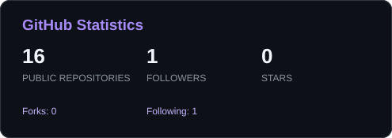
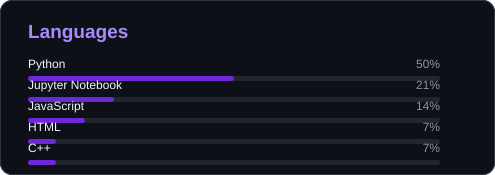
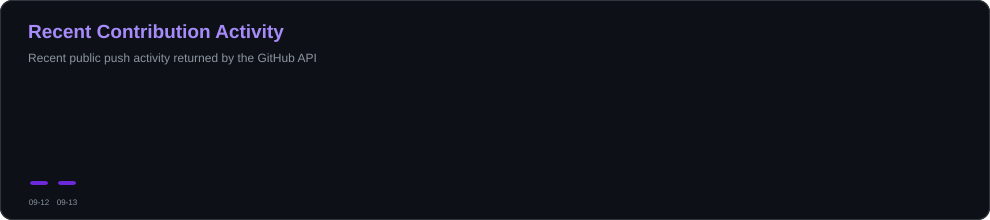

<div align="center">


<a href="https://github.com/karee-29">

</a>

<br/>


<br/><br/>

<a href="https://github.com/karee-29">

</a>

<a href="https://github.com/karee-29?tab=repositories">

</a>

</div>

---

## 👋 Hey, I'm Karan

```text
┌──────────────────────────────────────────────────────────────┐
│                                                              │
│   $ whoami                                                   │
│                                                              │
│   Karan Kumar Soundrapandian                                 │
│                                                              │
│   Electronics & Computer Engineering student                 │
│   who enjoys turning ideas into working systems.             │
│                                                              │
│   I like →                                                   │
│                                                              │
│   Software        ████████████████████░░  building           │
│   AI / ML         ██████████████████░░░░  experimenting      │
│   Data            █████████████████░░░░░  analysing          │
│   Systems         ███████████████░░░░░░░  understanding      │
│   Algorithms      ████████████████░░░░░░  solving            │
│                                                              │
│   Current status: probably debugging something               │
│                                                              │
└──────────────────────────────────────────────────────────────┘
```

I'm an **Electronics & Computer Engineering student at Thapar Institute of Engineering & Technology** who enjoys building things across software, AI/ML, data, systems and algorithms.

I like going beyond making something *work* — I want to understand **why it works**, what happens underneath, and how to make it better.

### ⚡ Things I enjoy

`Software Engineering` · `AI/ML` · `Data Analytics` · `Systems` · `Algorithms` · `Networking` · `Product Engineering` · `Optimization`

### 🔭 Currently exploring

`DSA` · `Machine Learning` · `Generative AI` · `Full Stack` · `Systems` · `Networking` · `Optimization` · `Data Analytics`

---

# 🧰 My Toolbox

<div align="center">

### 💻 Languages


<br/><br/>

### 🌐 Web & Backend


<br/><br/>

### 🤖 AI / ML / Data


<br/><br/>

### 🛠️ Tools & Engineering


</div>

---

# 🚀 Things I've Built

> Not just notebooks. Not just tutorials.
>
> **Projects where I get to build, break, debug and learn.**

---

## 🧠 Customer Churn Prediction

<details>
<summary><b>→ Open project details</b></summary>

A machine-learning workflow for identifying customers who are at risk of leaving and turning model output into actionable retention insights.

### Built with

`Python` `Pandas` `NumPy` `Scikit-learn` `Jupyter`

### Explored

- Data cleaning & preprocessing
- Exploratory data analysis
- Feature engineering
- Classification
- Model evaluation
- Model interpretation
- Business-oriented insights

### Repository

🔗 https://github.com/karee-29/customer-churn-prediction

</details>

---

## 🛒 Advanced Retail Customer Intelligence Platform

<details>
<summary><b>→ Open project details</b></summary>

A customer and transaction analytics project designed to understand **who customers are, what they buy, and how valuable they are**.

### Built with

`Python` `Pandas` `NumPy` `Jupyter`

### Explored

- Customer segmentation
- RFM-style analysis
- Purchasing behaviour
- Customer value
- Transaction analysis
- Behavioural patterns
- Business recommendations

### Repository

🔗 https://github.com/karee-29/advanced-retail-customer-intelligence-platform

</details>

---

## ⚡ EV Two-Wheeler Market Entry Strategy

<details>
<summary><b>→ Open project details</b></summary>

A data-driven exploration of the electric two-wheeler market combining quantitative analysis with competitive and customer-oriented thinking.

### Built with

`Python` `Pandas` `Data Analysis` `Market Research`

### Explored

- Market analysis
- Competitive landscape
- Customer segmentation
- Customer needs
- Market positioning
- Market-entry strategy
- Business recommendations

### Repository

🔗 https://github.com/karee-29/ev-two-wheeler-market-entry-strategy

</details>

---

## ☁️ Production-Grade CI/CD Cloud Deployment Platform

<details>
<summary><b>→ Open project details</b></summary>

An engineering-focused project around automated testing, continuous integration and deployment workflows.

### Built with

`Python` `Git` `GitHub Actions` `CI/CD` `Cloud`

### Explored

- Workflow automation
- Automated validation
- Continuous integration
- Deployment pipelines
- Version control
- Engineering practices

### Repository

🔗 https://github.com/karee-29/production-grade-CI-CD-cloud-deployment-platform

</details>

---

## 🌐 Network Packet Analyzer

<details>
<summary><b>→ Open project details</b></summary>

A simplified Wireshark-style packet analysis project built to understand what actually happens when machines communicate.

### Built with

`Python` `Networking` `TCP/IP` `Packet Analysis`

### Explored

- Packet inspection
- Protocol identification
- Network layers
- Transport-layer behaviour
- Packet-level communication
- Network analysis

### Repository

🔗 https://github.com/karee-29/network-packet-analyzer

</details>

---

## 🧠 Neural Network From Scratch

<details>
<summary><b>→ Open project details</b></summary>

A from-scratch implementation designed to understand what happens underneath high-level machine-learning libraries.

### Built with

`Python` `Mathematics` `Neural Networks`

### Explored

- Neural-network fundamentals
- Forward propagation
- Training mechanics
- Model experimentation
- Mathematical intuition

### Repository

🔗 https://github.com/karee-29/neural-network-from-scratch

</details>

---

# 🧩 My Engineering Map

<div align="center">

| 🖥️ Software | 🤖 AI / ML | 📊 Data |
|:---:|:---:|:---:|
| Full Stack | Classical ML | EDA |
| APIs | Neural Networks | SQL |
| Backend | Generative AI | Analytics |
| Databases | Computer Vision | BI |

| 🌐 Systems | ⚙️ Algorithms | 🚀 Product |
|:---:|:---:|:---:|
| Networking | DSA | Product Engineering |
| TCP/IP | Graphs | Optimization |
| OS Concepts | Shortest Paths | Business Analytics |
| Packet Analysis | MST / TSP | Strategy |

</div>

---

# 🔬 Current Lab

```yaml
# karan.config

identity:
  role: "Electronics & Computer Engineering Student"
  mode: "Build → Break → Debug → Learn"

learning:
  - Data Structures & Algorithms
  - Machine Learning
  - Generative AI
  - Software Engineering
  - Systems & Networking

building:
  - AI-powered applications
  - Data & analytics projects
  - Full-stack systems
  - Algorithm visualizations
  - Networking projects

experimenting_with:
  - LLM applications
  - Computer Vision
  - Optimization
  - Cloud & DevOps
  - Applied analytics

debugging:
  - "Why does it work on my machine?"
  - "Why did changing one line break everything?"
  - "Why is the model doing THAT?"
  - "Where did that bug even come from?"

status:
  coffee: "required"
  bugs: "expected"
  curiosity: "high"
  sleep: "under investigation"
```

---

# ⚙️ Developer.exe

<div align="center">

```text
┌────────────────────────────────────────────────┐
│                 DEVELOPER.EXE                  │
├────────────────────────────────────────────────┤
│                                                │
│  INPUT        → Interesting Problem            │
│                                                │
│  PROCESSING   → Too Much Coffee                │
│                                                │
│  ALGORITHM    → Build → Break → Debug         │
│                                                │
│  COMPILER     → Why is this not working?       │
│                                                │
│  DEBUGGER     → Ah... there it is.             │
│                                                │
│  OUTPUT       → Something That Actually Works  │
│                                                │
│  ERROR 404    → Sleep Not Found                │
│                                                │
│  STATUS       → Learning...                    │
│                                                │
└────────────────────────────────────────────────┘
```

</div>

---

# 🧠 Engineering Philosophy

> **Don't just use the abstraction. Understand what's underneath it.**

Whether it's an API, neural network, database, routing algorithm or distributed system — I enjoy going one layer deeper.

```text
        Learn
          ↓
        Build
          ↓
        Break
          ↓
       Debug
          ↓
     Understand
          ↓
       Improve
          ↓
        Build
          ↓
         🔁
```

---

# 🗺️ The Developer Roadmap

```text
                    ┌─────────────────┐
                    │   Learn More    │
                    └────────┬────────┘
                             │
                             ▼
                    ┌─────────────────┐
                    │   Build Things  │
                    └────────┬────────┘
                             │
                             ▼
                    ┌─────────────────┐
                    │ Break Something │
                    └────────┬────────┘
                             │
                             ▼
                    ┌─────────────────┐
                    │     Debug       │
                    └────────┬────────┘
                             │
                             ▼
                    ┌─────────────────┐
                    │ Understand Why  │
                    └────────┬────────┘
                             │
                             ▼
                    ┌─────────────────┐
                    │   Build Better  │
                    └────────┬────────┘
                             │
                             └───────────────→ 🔁
```

---

# 📊 GitHub Activity

<div align="center">




<br/><br/>



<br/><br/>


</div>

---

# 🧪 Random Developer Facts

<div align="center">

| | |
|---|---|
| 🧩 | I like solving problems that initially look unnecessarily complicated |
| 🔍 | I tend to ask what is happening underneath the abstraction |
| 🛠️ | I'd rather build a small working system than only read about one |
| 🐛 | Bugs are basically unpaid teachers |
| ☕ | Coffee has suspiciously strong involvement in the development process |
| 🔁 | Build → Break → Debug → Learn → Repeat |

</div>

---

# 📚 What I'm Working Towards

```text
                    SOFTWARE
                       │
          ┌────────────┼────────────┐
          │            │            │
          ▼            ▼            ▼
        SYSTEMS       DATA         AI/ML
          │            │            │
          └────────────┼────────────┘
                       │
                       ▼
                 PRODUCT THINKING
                       │
                       ▼
                REAL-WORLD SYSTEMS
```

My goal is to become the kind of engineer who can move comfortably between:

**problem → idea → architecture → implementation → data → deployment → improvement**

---

# 🤝 Let's Connect

<div align="center">

<a href="https://github.com/karee-29">

</a>

<a href="https://github.com/karee-29?tab=repositories">

</a>

</div>

<br/>

<div align="center">

### `while(alive) { learn(); build(); breakThings(); repeat(); }`

<br/>


</div>
